Yhteen tauluun kohdistuvien kyselyiden harjoitukset

1
select * from goal;
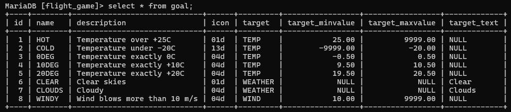

2
SELECT name, type FROM airport WHERE iso_country = 'FI';
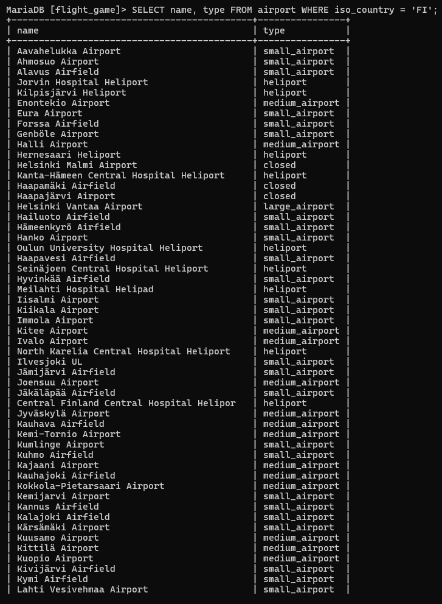

3
SELECT name from airport where iso_country = 'FI' order by name asc;
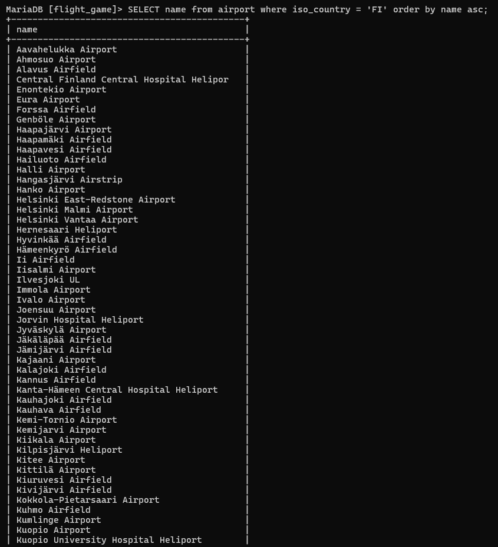

4
select name, type from airport where iso_country = 'FI' order by type, name;
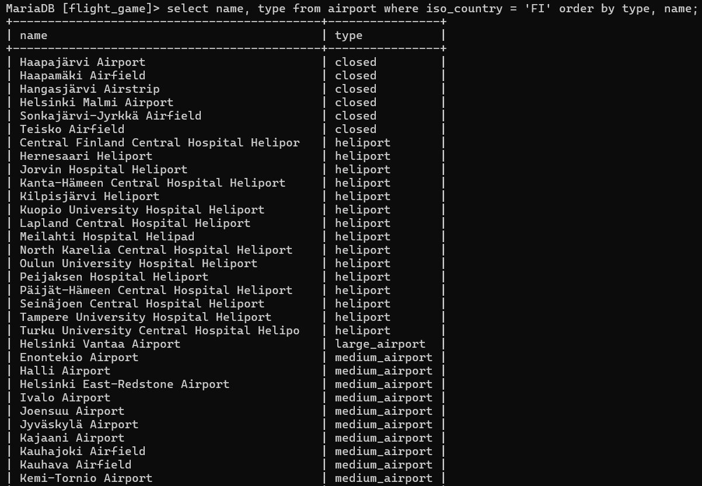

5
select name from country where name like 'F%';
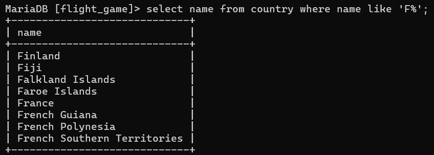

6
select name from country where name like '%F%';
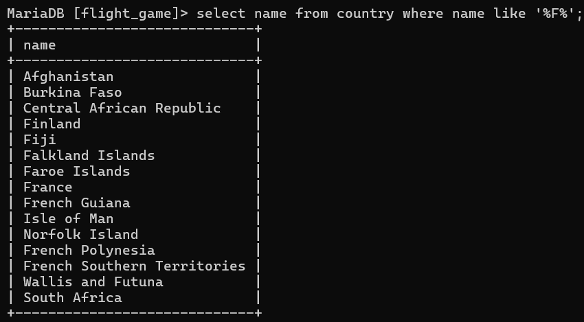

7
select location from game where screen_name = 'Vesa';
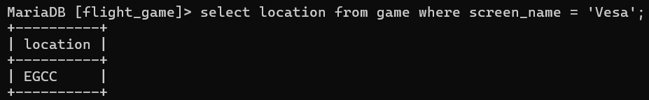

8
select co2_consumed from game where screen_name = 'Ilkka';
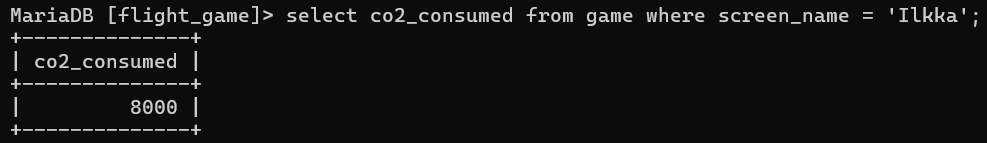

9
select co2_budget from game where id = '1';
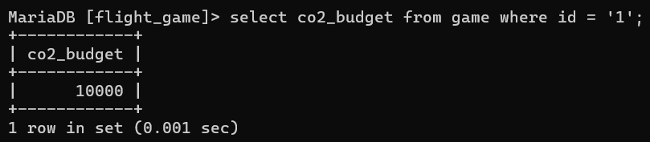

Where-osan liitosehto harjoitukset

1
select country.name as 'country name', airport.name as 'airport name' from airport inner join country on airport.iso_country = country.iso_country where country.name ='Iceland';
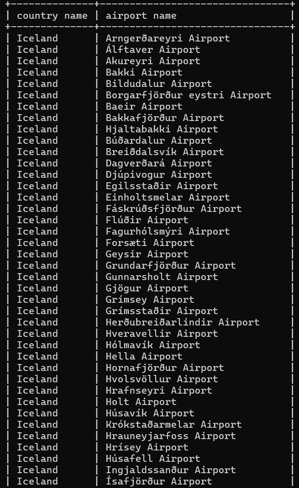

2
select name as 'airport name' from airport where iso_country = 'FR' and type = 'large_airport';
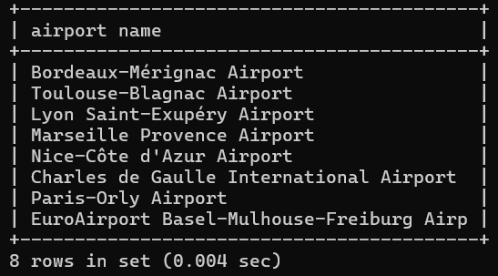

3
select country.name as 'country_name', airport.name as 'airport_name' from airport inner join country on country.iso_country = airport.iso_country where airport.continent = 'AN';
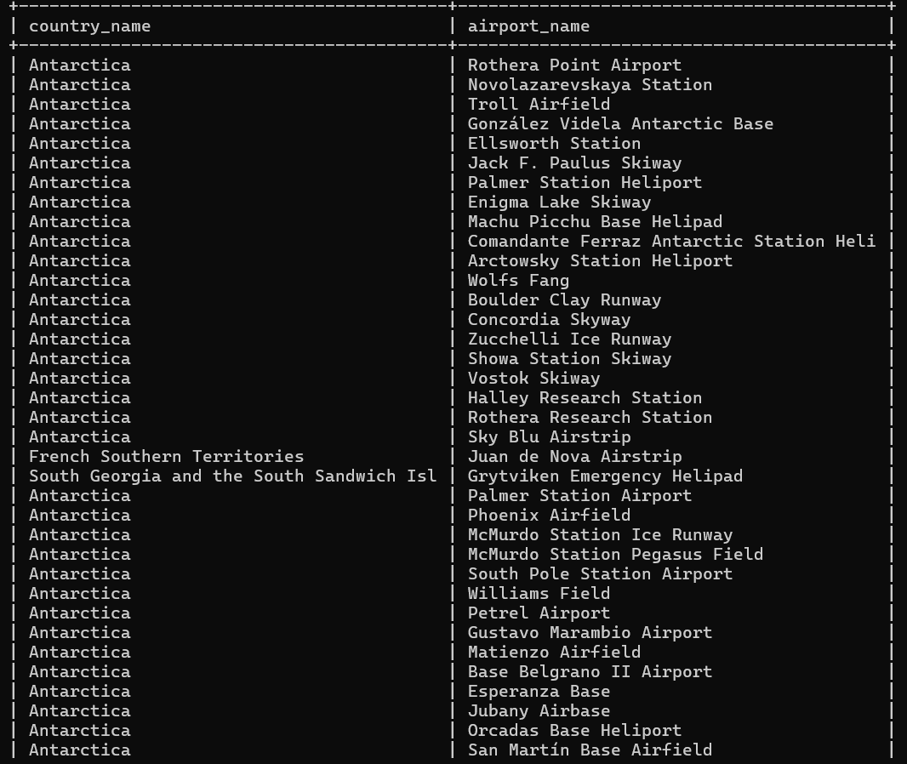

4
select airport.elevation_ft from airport inner join game on airport.ident = game.location where game.screen_name = 'Heini';
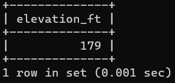

5
select airport.elevation_ft*0.3048 as 'elevation_m' from airport inner join game on airport.ident = game.location where game.screen_name = 'Heini';
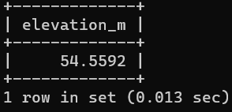

6
select airport.name from airport inner join game on airport.ident = game.location where game.screen_name = 'Ilkka';
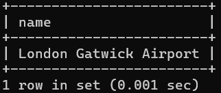

7
select country.name from airport inner join game on airport.ident = game.location inner join country on airport.iso_country = country.iso_country where game.screen_name = 'Ilkka';
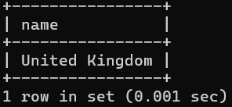

8
select goal.name from goal inner join goal_reached on goal.id = goal_reached.goal_id inner join game on goal_reached.game_id = game.id where game.screen_name = 'Heini';
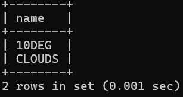

9
select airport.name from goal inner join goal_reached on goal.id = goal_reached.goal_id inner join game on goal_reached.game_id = game.id inner join airport on game.location = airport.ident where goal.name = 'clouds' and game.screen_name = 'Ilkka';
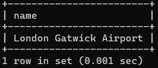

10
select country.name from goal inner join goal_reached on goal.id = goal_reached.goal_id inner join game on goal_reached.game_id = game.id inner join airport on game.location = airport.ident inner join country on airport.iso_country = country.iso_country where goal.name = 'clouds' and game.screen_name = 'Ilkka';
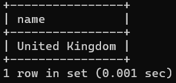

Join harjoitukset

1
select country.name, airport.name from airport inner join country on airport.iso_country = country.iso_country where country.name = 'Finland' and airport.scheduled_service = 'yes';
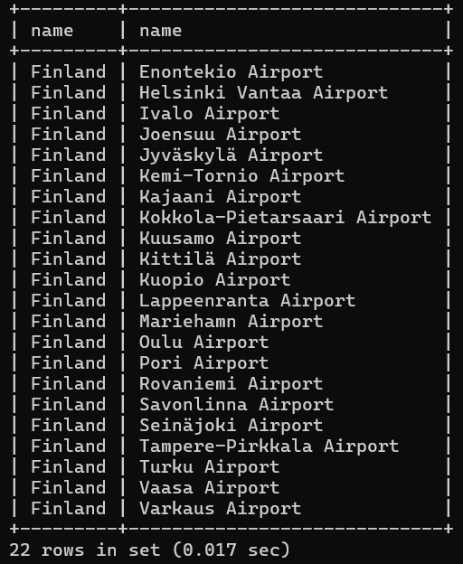

2
select game.screen_name, airport.name from airport inner join game on airport.ident = game.location;
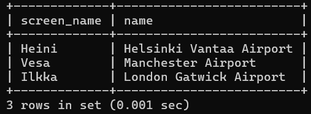

3
select game.screen_name, country.name from (country inner join airport on airport.iso_country = country.iso_country) inner join game on game.location = airport.ident;
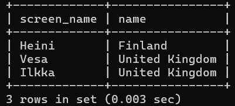

4
select airport.name, game.screen_name from airport left outer join game on airport.ident = game.location where airport.name like '%Hels%';
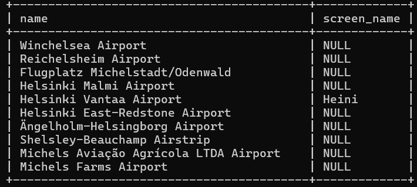

5
select goal.name, game.screen_name from goal left outer join goal_reached ON goal_reached.goal_id = goal.id left outer join game on goal_reached.game_id = game.id;
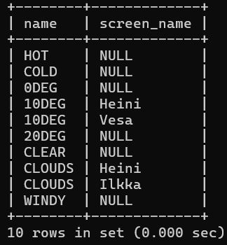

Sisäkysely harjoitukset

1
select country.name from country inner join airport on country.iso_country = airport.iso_country where airport.name like 'Satsuma%';
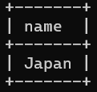

2
select name from airport where iso_country = 'MC';
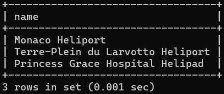

3
select game.screen_name from game inner join goal_reached on game.id = goal_reached.game_id inner join goal on goal_reached.goal_id = goal.id where name = 'clouds';
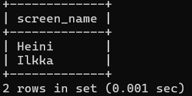

4
select country.name from country where country.iso_country not in (select airport.iso_country from airport);
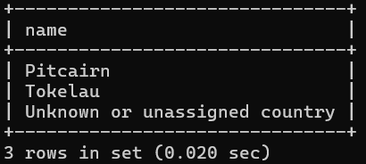

5
select goal.name from goal where goal.id not in (select goal_reached.goal_id from goal_reached inner join game on goal_reached.game_id = game.id where game.screen_name = 'Heini');
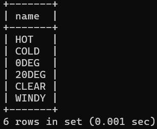

Koostetieto kyselyt harjoitukset

1
select max(elevation_ft) from airport;
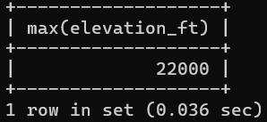

2
select continent, count(*) from country group by continent;

3
select screen_name, count(*) from goal_reached inner join game on goal_reached.game_id = game.id group by screen_name;
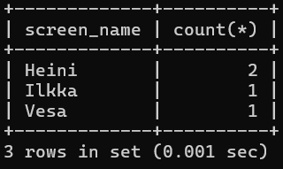

4
select screen_name from game order by co2_consumed limit 1;
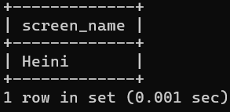

5
select country.name, count(*) from country inner join airport on country.iso_country = airport.iso_country group by country.name order by count(*) desc limit 50;
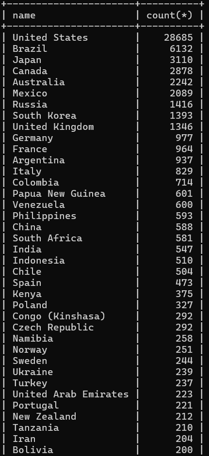

6
select country.name from country inner join airport on country.iso_country = airport.iso_country group by country.iso_country having count(*) >= 1000;
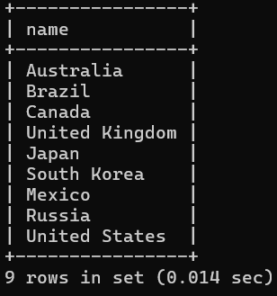

7
select name from airport where elevation_ft in (select max(elevation_ft) from airport);
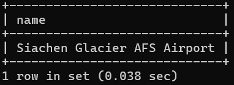

8
select country.name from country inner join airport on country.iso_country = airport.iso_country where elevation_ft in (select max(elevation_ft) from airport);
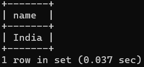

9
select count(*) from goal inner join goal_reached on goal.id = goal_reached.goal_id inner join game on goal_reached.game_id = game.id where screen_name = 'Vesa';
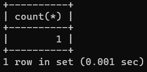

10
select name from airport order by latitude_deg limit 1;
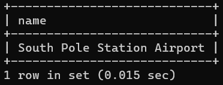

